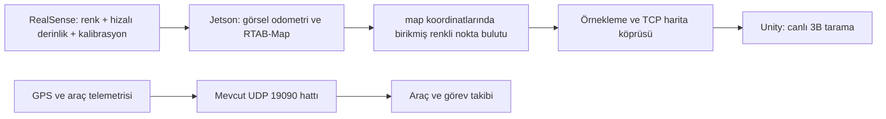

# Uçuş sırasında çevrenin dijital ikizini oluşturma

**8 Eylül 2026 — yer istasyonu bağlantısı uygulandı; gerçek kamera–Jetson–uçuş zinciri henüz doğrulanmadı.**

Donanım bilgisi kullanıcıdan “RealSense D400 serisi, Jetson Xavier/J202, GPS” olarak alındı. Kameranın tam modeli, JetPack/Ubuntu sürümü, IMU ve mevcut ROS kurulumu henüz bilinmiyor. Bu yüzden belirli bir cihazı kurulu veya çalışır kabul etmiyoruz.

## Ne değişti?

“Dijital ikiz” açıldığında artık **Canlı 3B tarama** seçili. Sensörden bir harita gelene kadar boş ölçüm alanı ve “İlk 3B ölçüm bekleniyor” gösteriliyor. **Referans ortofoto** düğmesiyle önceki hazır saha açılabiliyor. Referans saha, uçuşta yeniden oluşturulmuş çevre diye sunulmuyor.

Yer istasyonu şu işleri yapabiliyor:

- Jetson'un ürettiği, aynı SLAM harita koordinatlarında birleştirilmiş renkli nokta bulutunu TCP 19093 üzerinden almak.
- Tamamı doğrulanan haritayı tek seferde yenilemek; eksik aktarımda eski modeli korumak.
- Son ölçüm zamanını, kaynak bilgisini, nokta sayısını ve örnekleme aralığını göstermek. Beş saniyeyi aşan ölçümü canlı göstermemek.
- Haritada döndürme, kaydırma, yakınlaştırma ve üstten bakış kullanmak.
- Son gösterilen haritayı PLY ve kimlik/zaman/koordinat bilgilerini JSON olarak kaydetmek.
- Yeni uçuşta “Oturumu sıfırla” ile eski haritayı ve kaynak kilidini temizlemek.

Bu bir **renkli nokta bulutu önizlemesi**. Kapalı yüzeylerden oluşan, dokulu ve ölçme doğruluğu kanıtlanmış bir mesh değildir. Noktasız yerler bilinmiyor; otomatik olarak boş veya uçuşa uygun kabul edilmez. Ekrandaki 2 m çizgiler yalnızca referans ızgarasıdır.

## Gerçek veri hattı



RealSense derinlik verisi iki kamera arasındaki stereo geometriden gelir. SLAM, ardışık ölçümleri ortak konum ve yönelimde birleştirir. Sadece kameranın o an gördüğü derinlik karesini göndermek, bütün çevrenin haritasını oluşturmaz. Köprü bu yüzden kamera optik koordinatındaki bulutları reddeder; sabit harita çerçevesi bekler.

RTAB-Map ROS 2, stereo ve RGB-D sensör entegrasyonlarına sahiptir. Burada RealSense'in hizalanmış RGB-D çıktısı kullanılacak şekilde bir başlatma dosyası hazırlandı. Kameranın IMU'lu sürümü doğrulanmadığı için bu dosya IMU varsaymaz. [RTAB-Map](https://github.com/introlab/rtabmap_ros), [RealSense ROS sürücüsü](https://github.com/realsenseai/realsense-ros).

**GPS henüz bu yeni 3B bulutu uydu haritasına hizalamıyor.** Yerel SLAM eksenlerini gerçek doğu/kuzey/yukarı eksenlerine bağlamak için konum, yönelim, sensör montaj dönüşümü ve yükseklik referansı belirlenmeli. Tek bir GPS noktası yönelimi vermez. Bu yüzden canlı taramada araç simgesi eski haritadan kopyalanmıyor; yanlış bir coğrafi eşleşme yapılmıyor.

## Jetson'da önce sürümleri belirleme

`Tools/LiveMapping` klasörünü Jetson'a kopyalayıp bu klasörde çalıştır:

```bash
bash inspect_jetson.sh
```

Bu komut yalnızca donanım/işletim sistemi/ROS/paket durumunu okur; kurulum veya silme yapmaz. Kamera etiketiyle D435, D435i, D455 gibi tam modeli de doğrula.

Bu paket **ROS 2** içindir. Xavier destekli JetPack 5.1.4'ün kök dosya sistemi Ubuntu 20.04 tabanlıdır; güncel RTAB-Map ROS 2 dalı en az Humble ister. Bu nedenle Jetson'a otomatik olarak Ubuntu 22.04/Humble kurulmuş gibi davranılmadı. Mevcut JetPack ve kamera sürücüsü görülmeden doğrudan sistem yükseltme ya da kurulum yapılmamalı; uygun ROS ortamı ayrıca hazırlanmalı. [NVIDIA JetPack 5.1.4](https://developer.nvidia.com/embedded/jetpack-sdk-514), [RTAB-Map gereksinimleri](https://github.com/introlab/rtabmap_ros).

## ROS 2 ortamı hazır olduğunda çalıştırma

Gerekli paketler: `realsense2_camera`, `rtabmap_launch`, `rtabmap_odom`, `rtabmap_slam`, `sensor_msgs`, `rclpy`. `ros2 pkg prefix PAKET_ADI` ile kontrol edilebilir. ROS ortamının `setup.bash` dosyası her terminalde yüklenmiş olmalı.

1. Yer istasyonunu Unity Play veya uygulama olarak aç. **Dijital ikiz → Canlı 3B tarama** görünümüne geç. İlk bağlantıda boş alan normaldir.
2. Jetson'da, `Tools/LiveMapping` klasöründe kamera ve haritalamayı başlat:

```bash
ros2 launch ./realsense_rtabmap.launch.py
```

3. Ayrı bir Jetson terminalinde veri çıkışını kontrol et:

```bash
ros2 topic hz /camera/color/image_raw
ros2 topic hz /camera/aligned_depth_to_color/image_raw
ros2 topic hz /rtabmap/cloud_map
```

İlk iki komutu ayrı ayrı çalıştırıp Ctrl+C ile bitirebilirsin. `cloud_map`, `sensor_msgs/msg/PointCloud2` olmalı; `header.frame_id` değeri `map` olmalı. Yayın yalnızca abone varken üretilebilir. Kalibrasyon için `/camera/color/camera_info`, kamera–harita dönüşümü için TF zinciri de kontrol edilmeli. Konu adları kurulu sürücüye göre farklıysa launch dosyasındaki eşlemeleri gerçek isimlerle değiştir. [RTAB-Map harita yayıncısı](https://github.com/introlab/rtabmap_ros/blob/ros2/rtabmap_util/src/MapsManager.cpp).

4. Harita köprüsünü başlat:

```bash
export SIMURGH_MAP_TOKEN='simurgh-2026'
python3 ros2_map_bridge.py --host YER_ISTASYONU_IP --map-id ucus-001
```

`YER_ISTASYONU_IP` aynı yerel ağdaki Windows bilgisayarının IP'sidir. Örnekteki token projedeki geliştirme varsayılanıdır. İki uçta aynı özel token kullanılabilir: Windows'ta Unity/uygulama başlatılmadan önce `SIMURGH_MAP_TOKEN` tanımlanır veya alıcının Inspector alanı ayarlanır. Bu TCP kanalı TLS sağlamaz; mevcut yerel bağlantı protokolüdür. Ağ/firewall TCP 19093 bağlantısına izin vermeli. Bilgisayar ve Jetson saatleri uyumlu olmalı.

5. Yeni haritalama oturumunda yeni `--map-id` kullan ve yer istasyonunda “Oturumu sıfırla” seç. Aynı oturumdaki köprüyü yeniden başlatırken eski sıra numarasını kullanma; bu durumda da yeni oturum aç.

Launch her çalıştırmada `~/.ros/simurgh_TARIH.db` isimli yeni harita veritabanı seçer; mevcut dosyaları silmez. Tam yoğun harita Jetson'da kalır, yer istasyonuna sınırlı önizleme gönderilir. Başlangıç filtresi `Grid/RangeMax=3.0 m` olarak ayarlı; bu kameranın menzil iddiası değildir. Model ve gerçek derinlik testi sonucuna göre ayarlanır. [RTAB-Map parametreleri](https://github.com/introlab/rtabmap/blob/master/corelib/include/rtabmap/core/Parameters.h).

## Ağ ve harita sözleşmesi

Bir TCP bağlantısı bir tam harita sürümü taşır: `begin` → sıralı `points` parçaları → `end`. Mesajlar UTF-8, satır sonlu JSON'dur. Protokol `simurgh-live-map/1`; örnek üretici `Tools/LiveMapping/live_map_sender.py`.

| Alan / sınır | Anlamı |
|---|---|
| `sourceId`, `mapId`, `frameId` | İlk kabul edilen kaynak ve harita oturumu kilitlenir. Değişiklik için operatör sıfırlaması gerekir. |
| `sequence` | Pozitif ve artan sürüm; yinelenen/eski sürümler reddedilir. |
| `capturedAtMs` | Kaynak bulutun Unix ölçüm zamanı; eski kayıtlar güncelmiş gibi yeniden zamanlanmaz. |
| `frameConvention` | `ros_z_up_m`: ROS X/Y/Z, metre. Unity gösterimi X/Z/Y. Coğrafi kuzey hizalaması varsayılmaz. |
| `dataKind` | `measured`; `test` yalnızca açıkça etkinleştirilen yerel testte kabul edilir. |
| `voxelSizeM` | Göndericide kullanılan örnekleme aralığı; ölçüm doğruluğu değildir. |
| Nokta | `[x,y,z,r,g,b]`; sonlu koordinatlar, 0–255 tam sayı renk. |
| Sınırlar | En fazla 50.000 nokta, parçada 256 nokta, satırda 64 KiB, eksende ±10 km. |
| Güncellik | En fazla 5 saniye yaş; ileri saat farkı en fazla 1 saniye. Aktarım boyunca da denetlenir. |
| ACK `received` | Sürüm doğrulandı ve gösterim kuyruğuna alındı. Çizildi, uçuşta uygulandı veya fiziksel olarak doğru demek değildir. |

Varsayılan köprü 1 Hz, 0,15 m örnekleme ve 12.000 noktadır. Nokta sınırı aşılırsa bütün alanı koruyarak örnekleme aralığını büyütür; listenin sonunu kesip sahanın bir tarafını kaybetmez. Giriş en fazla 2 milyon nokta / 64 MiB; en fazla 200.000 giriş noktası düzenli aralıklarla değerlendirilir. Renk alanı yoksa tek temsil rengi kullanılır. Göndericide ve alıcıda yalnızca en son bekleyen sürüm tutulur. Yavaş bağlantıda `--max-points 4000 --hz 0.5` gibi değerlerle veri miktarı azaltılabilir; gerçek veri miktarı terminalde bayt olarak yazılır.

Her sürüm tam harita olduğundan loop closure sonrasında düzeltilen geometri eski sürümü değiştirir. Eksik bir aktarım haritayı yarım bırakmaz. Bu yaklaşım düşük bant genişliğinde parça/delta harita aktarımından daha çok veri kullanır; mevcut uygulama sınırlı önizleme içindir.

Bu hat uçuş komutu göndermez, UDP komut eşini seçmez ve araç telemetrisini güncellemez. Önceki telemetri JSONL kayıt/oynatımı **yeni nokta bulutu kanalını kapsamaz**. PLY, son gösterilen sürümün dışa aktarımıdır; zaman serisi kaydı değildir. Dosyalar Windows'ta `Application.persistentDataPath/LiveMaps` içine yazılır; test dışa aktarımları `Logs/LiveMapTestExport` içindedir.

## Gerçek uçuşta tamamlanacak doğrulama

- Tam RealSense modeli, Jetson modülü, JetPack/ROS sürümü ve kamera sürücüsünün birlikte çalışması.
- Renk–derinlik zaman eşlemesi ve kalibrasyonu; kameranın gövdeye göre dönüşümü. IMU'lu model varsa uygun IMU/TF entegrasyonu.
- Gerçek derinlikten oluşan haritanın hareket sırasında büyümesi ve aynı yere dönüşte çift duvar/drift davranışı.
- GPS, SLAM ve yükseklik referanslarının hizalanması. Bu hizalama henüz uygulanmadı.
- Hedef yükseklikte ve güneş/tekstür/titreşim koşullarında kullanılabilir derinlik oranı; gerçek Jetson işlem süresi ve kablosuz ağ gecikmesi.
- Bağlantı kesildiğinde son haritanın korunması ve güncellik uyarısı; tekrar bağlanınca yeni sürümle toparlama.

**40–50 metre irtifadan D400 ile ayrıntılı derinlik haritası çıkarılacağını vaat etme.** Örneğin üretici D455 için ideal aralığı 0,6–6 m olarak veriyor; bu, kullanıcının kamerasının D455 olduğunu söylemez. Yüksek irtifa görevi için sensör, uçuş planı veya görüntülerden yeniden yapılandırma yaklaşımı ayrıca değerlendirilmelidir. [RealSense D455 teknik bilgileri](https://www.realsenseai.com/products/real-sense-depth-camera-d455f/).

## Bilgisayarda doğrulananlar

`python Tools/LiveMapping/test_live_map.py`: 14 Python kontrolü. Bu komut yerel **sentetik** test avlusu üretir; gerçek uçuş veya kamera kaydı değildir.

Unity Play içindeki `Tools → Simurgh → Canli Harita Kontrolu (Play)`: Python'un ürettiği çok parçalı veri, C# doğrulama, gerçek loopback TCP, renkli render piksel kontrolü, PLY, güncellik, oturum kilidi, görünüm değişimi ve kapanış kontrolleri. Sonuç `Logs/live-map-checks.txt`; 11:29 çalışmasında **37 kontrol geçti**. Yavaş bağlantının toplam zaman sınırı ve harita düzeltmesinde eski geometrinin kaldırılması da sınandı. Testin sonunda örnek harita temizlenir ve test kabulü kapatılır. Görseller `Logs/live-map-ui-test.png` ve `Logs/live-map-waiting.png`.

Mevcut yer istasyonu, HUD, harita ve referans saha regresyonları da 8 Eylül 2026 **11:28:54** çalışmasında geçti. `Logs/groundstation-full-validation.txt` raporu. Eski harita testinde, bilerek kaldırılan parçanın önbellekten otomatik onarılmasıyla oluşan zamanlama yarışı giderildi; eksik parça artık aynı karede render edilerek denetleniyor. Gerçek RealSense/Jetson, ROS düğümleri ve uçuş bu Windows testinde çalıştırılmadı. Launch dosyasında sözdizimi kontrolü yapılması cihaz uyumluluğu testi değildir.

## Mülakatta güncel anlatım

> “Hedefimiz, İHA uçarken RealSense'ten gelen derinlik ölçümlerini Jetson üzerinde SLAM ile birleştirip çevrenin 3B temsilini oluşturmak. Yer istasyonunda bu haritayı alan, güncelliğini denetleyen ve sürekli gösteren bağlantıyı geliştirdik. Referans ortofotoyla canlı ölçümü ayrı gösteriyoruz. Yazılım aktarım ve gösterim testleri geçti; kamera, Jetson, GPS hizalaması ve gerçek uçuşu kapsayan uçtan uca doğrulamayı henüz tamamlamadık.”

“Hazır RTAB-Map bizim geliştirmemizdir” deme. Katkı: bu projedeki protokol, aktarım köprüsü, kaynak/zaman/oturum kontrolleri, Unity gösterimi, operatör arayüzü ve testler. SLAM ve kamera sürücüsü ayrı açık kaynak bileşenlerdir.
