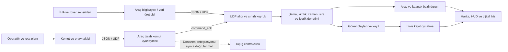

# TEKNOFEST 2026 Serbest Görev — Yer istasyonu ve dijital ikiz mülakat hazırlığı

**Mert için, yer istasyonu sorumluluğuna göre hazırlanmıştır.** Kod ve test incelemesi: 8 Eylül 2026. Bu not, mevcut `groundstation-main` projesini temel alır. Cevap taslaklarında kişisel katkını gerçekten yaptığın işlerle eşleştir; ekip arkadaşının geliştirdiği veya henüz sahada denenmemiş bir özelliği kendin tamamlamış gibi anlatma.

## 1. Önce söyleyeceğin ana fikir

**Canlı harita güncellemesi:** Bu rehberin ilk incelemesinden sonra ayrı bir TCP nokta bulutu alıcısı, canlı 3B tarama ekranı ve RealSense/RTAB-Map ROS 2 köprüsü eklendi. Önceden hazırlanmış saha hâlâ ayrı bir referans görünümüdür. Yeni yazılımın yerel aktarım/gösterim testleri geçti; gerçek kamera–Jetson–GPS–uçuş zinciri doğrulanmadı. Dijital ikizin mevcut durumu ve güncel mülakat cevabı için [Canlı dijital ikiz rehberini](CANLI-DIJITAL-IKIZ.md) esas al.

> Yer istasyonunu, İHA ve rover’ın görevini operatörün tek bir ekrandan anlayabilmesi için geliştiriyoruz. Harita, rota, telemetri, hedefler ve bağlantı durumunu ortak bir coğrafi çerçevede birleştiriyoruz. Dijital ikizin amacı, sahayı ve araçların son doğrulanmış durumunu anlaşılır bir temsile dönüştürmek. Böylece operatör yalnızca sayılara bakmak yerine görevin nerede ve hangi durumda olduğunu takip edebiliyor. Veri kesildiğinde de eski durumu canlıymış gibi sunmuyoruz.

Bu cümleyi ezberlemekten çok şu zinciri öğren: **problem → tasarım kararı → uygulama → test → sınır.**

Örnek: “Birden fazla aracın verisi karışabiliyordu → araç ve kaynak durumlarını ayırdık → ayrı telemetri tabloları kullandık → rover verisinin İHA bataryasını değiştirmediğini test ettik → bunun gerçek araç tarafındaki sensör doğruluğunu kanıtlamadığını biliyoruz.”

## 2. Yarışma bağlamı

2026 şartnamesinin 8.2 bölümünde Serbest Görev mülakatı genellikle soru-cevap olarak, takım başına 15 dakika şeklinde tanımlanıyor; hakemler süreyi değiştirebilir. Ekonomiklik/sadelik, yenilikçilik/özgünlük ve yerli ürün beyanlarının açıklanması bekleniyor. Bu süre yalnızca senin yer istasyonu anlatımın için ayrılmış bir süre değildir. [2026 şartnamesi, s.24](https://cdn.teknofest.org/media/upload/userFormUpload/2026_%C4%B0HA_Yar%C4%B1%C5%9Fmalar%C4%B1_%C5%9Eartnamesi_TR_v6_CJbHl.pdf)

PSR kılavuzu görev akışını, sensör-karar-eylem ilişkisini, manuel müdahale sınırını, değişen koşullara tepkiyi ve kanıtlanabilir takım katkısını açıklamanı istiyor. Buradaki hazırlık soruları benim projene göre oluşturduğum çalışma sorularıdır; resmî soru listesi değildir. [2026 Serbest Görev PSR kılavuzu](https://cdn.teknofest.org/media/upload/userFormUpload/2026_Uluslararas%C4%B1_%C4%B0HA_Serbest_G%C3%B6rev_PSR_Haz%C4%B1rlama_K%C4%B1lavuzu_XvSNR.pdf)

Hazır bir ürünü Türkiye’deki satıcıdan almak tek başına yerli üretim sayılmıyor. Yazılımın takım katkısını da kullanılan yabancı altyapılardan ayırarak anlat. [2026 Serbest Görev video kılavuzu, yerli katkı bölümü](https://cdn.teknofest.org/media/upload/userFormUpload/2026_ULUSLARARASI_%C4%B0HA_SERBEST_G%C3%96REV_KATEGOR%C4%B0S%C4%B0_G%C3%96REV_V%C4%B0DEOSU_HAZIRLAMA_KIL.pdf)

## 3. Bir dakikalık tanıtım taslağın

> Ben ekipte yer istasyonunun geliştirilmesinden sorumluyum. Görevimizde İHA ve rover’a ait konum, görev ve bağlantı bilgilerini operatörün birlikte değerlendirmesi gerekiyor. Bu nedenle Unity ve C# kullanarak harita, rota planlama, telemetri ve dijital ikiz bileşenlerini aynı uygulamada birleştiriyoruz.
>
> Araç mesajları JSON üzerinden UDP ile geliyor. Mesajı doğrudan ekrana yansıtmadan önce şemasını, kaynağını, zamanını, sırasını ve içeriğini denetliyoruz. İHA ve rover’ın durumlarını ayrı tutuyoruz. Dijital ikizde doğrulanmış konumları coğrafi referanslı saha üzerinde gösteriyoruz; veri güncel değilse bunu açıkça belirtiyoruz.
>
> Komut tarafında da gönderildi bilgisiyle uygulandı bilgisini ayırıyoruz. Örneğin rota yükleme onayı gelmeden görev başlatılmıyor. Geliştirme sırasında hata senaryolarını, kayıt oynatmayı ve harita geçişlerini test ettik. Şu an güçlü olduğumuz alan yer istasyonu yazılımı ve doğrulama altyapısı; gerçek uçuş kontrolcüsü entegrasyonunu ise araç tarafı onayı ve saha testleriyle ayrıca kanıtlamak gerekiyor.

**Kısaltman gerekirse:** İlk paragrafı, dijital ikizin amacını ve tek bir kanıtı söyle. Sınıf isimlerini ancak sorulursa anlat.

## 4. Mimariyi çizerek anlat

**Ayrım:** Bu depoda yer istasyonu bulunuyor. Araç üzerindeki sensör sürücüleri, uçuş kontrolcüsü yazılımı ve fiziksel komut uyarlayıcısının çalıştığı burada kanıtlanmış değil. Dışarıda çalışan bir araç hattınız varsa onun sürümünü, test kaydını ve sorumlusunu da anlatıma ekle.

**Telemetri:** Araç → yer istasyonu. **Komut:** Yer istasyonu → araç. **Komut onayı:** Araç → yer istasyonu. **Kayıt oynatma:** Yerel geçmiş veri → izole gösterim; fiziksel araç komutu üretmez.

## 5. Önce mevcut kapsamı doğru bil

| Konu | Mevcut projede savunabileceğin kapsam |
|---|---|
| Harita ve rota | Uydu/sokak/3D görünümler, waypoint düzenleme, polygon survey, JSON dışa aktarma |
| Çok araç | İHA ve rover için ayrılmış durum; farklı kaynakların veri ve sıra sayaçlarının ayrılması |
| Canlı veri | JSON/UDP doğrulama, güncellik denetimi, eski verinin bilinmiyor olarak gösterilmesi |
| Komut | Doğrulanmış hedefe gönderim, onay kontrolü, zaman aşımı, rota yükleme-başlatma zinciri |
| Dijital ikiz | Ayrı canlı nokta bulutu görünümü ve TCP harita alıcısı; ayrıca referans ortofoto, saha içi araç işaretleri ve görev/durum gösterimleri. Gerçek kamera/Jetson/uçuş henüz doğrulanmadı |
| Saha modeli | Depoda örnek bir Cleveland ortofotosu var; yarışma alanının güncel taraması olduğu iddia edilmemeli |
| Yükseklik | Saha dosyasında gerçek DSM yok; ortofoto düz zemin üzerinde. Bina/ağaç taslakları ölçülmüş gerçek geometri sayılmaz |
| Araç işaretleri | Saha görünümündeki işaretler esas olarak yatay konumu gösteriyor; kalibre edilmiş altı serbestlik dereceli fiziksel araç modeli değil |
| SLAM | Yörünge karşılaştırması ayrı; canlı çevre haritası için RealSense/RTAB-Map ROS 2 başlatma dosyası ve nokta bulutu köprüsü hazırlandı. ORB-SLAM3 ve RTAB-Map takımın geliştirdiği algoritmalar değildir |
| Örnek SLAM | Depoda simüle kestirim dosyası da var. Onun sonucu gerçek ORB-SLAM3 performansı diye sunulamaz |
| Mesh | Gelen bağlantı metrikleri ve röle durumunun izlenmesi; gerçek 802.11s ağını Unity kurmuyor |
| Adaptif akış | Yerel işleme bütçesi ve bağlı video nesnesinin görünürlüğü değişiyor; vericide bitrate düşürüldüğü henüz bundan çıkmaz |
| Yeniden planlama | Rover için en yakın engelden uzaklaşan basit dolanma önerisi var; genel çarpışmasız ve optimal planlayıcı garantisi yok |
| Emniyet | Yer istasyonunda uyarı ve komut kontrolleri var; araç üstündeki bağımsız failsafe’in yerine geçmez |
| Doğrulama | Önceki yer istasyonu kontrollerine ek olarak canlı harita için 37 Unity ve 14 Python kontrolü geçti. Yerel yazılım testleri gerçek uçuşu veya sensör doğruluğunu kanıtlamaz |

## 6. Jüri soru bankası — amaç ve tasarım

### 1) Sen tam olarak ne yaptın?

“Benim sorumluluğum yer istasyonunun arayüzü, harita ve rota akışları, araç verisinin alınması ve dijital ikizle gösterilmesi. Katkımı ekranlarla, ilgili modüllerle ve test çıktılarıyla gösterebilirim.” Ardından gerçekten sahip olduğun iki örneği seç: kaynak ayrımı, survey, komut onayı, saha eşleme veya harita hata düzeltmesi. Her bileşeni tek başına yazdığını söylemen gerekmiyor.

### 2) Hangi problemi çözüyorsunuz?

“İHA ve rover birlikte görev yaparken araçların nerede olduğu, hangi hedefte bulunduğu, bağlantının sağlıklı olup olmadığı ve bilgilerin güncelliği ayrı ayrı takip edilirse operatörün işi zorlaşıyor. Yer istasyonumuz bunları ortak bir görev görünümünde topluyor.” Faydayı karar üzerinden anlat: “Operatör bu bilgiyle bekleyecek mi, hedefi inceleyecek mi, müdahale mi isteyecek?” Henüz ölçülmemiş hata azalması için yüzde verme.

### 3) Dijital ikizi neden yaptınız?

“Sahayı, araç konumlarını ve görev durumunu aynı mekânsal bağlamda görmek için. Kamera yalnızca baktığı alanı gösterirken saha görünümü görev alanının bütününü gösteriyor. Kamera görüntüsü kullanılamasa da telemetri geliyorsa konumu ve görev durumunu takip edebiliriz. Ancak telemetri de kesilirse ikiz fiziksel dünyayı yeni baştan bilemez; son doğrulanmış durumu ve veri kaybını gösterir.”

### 4) Normal haritadan farkı nedir?

“Harita coğrafi tabandır. İkiz tarafında buna araç kimliği, güncellik, görev olayları, hedefler ve kayıt geçmişi ekleniyor. Kullanıcı yalnızca ‘bu nokta neresi’ değil, ‘hangi araç hangi görev durumunda ve bu bilgi ne kadar yeni’ sorusunun cevabını alıyor.” Ayrı 3D kamera açmak tek başına dijital ikiz oluşturmaz; değer, veriyle temsil arasındaki bağdan gelir.

### 5) Canlı kameranın yerini alıyor mu?

“Birbirini tamamlıyorlar. Kamera beklenmedik bir nesneyi görmeye yarar; ortofoto ve ikiz ise mekânsal bağlamı korur. Eski ortofotodan yeni bir engeli tespit edemeyiz. Bu yüzden görüntü yokken ‘saha güvenlidir’ sonucu üretmeyiz.” Görüntüyü kapatmanın video üretimini ve ağ trafiğini de durdurup durdurmadığını ayrıca ölçmek gerekir.

### 6) Bu gerçekten dijital ikiz mi, yalnızca 3D model mi?

“Mevcut sürümü, telemetriyle güncellenen operasyonel dijital ikiz prototipi olarak tanımlıyorum. Statik 3D modelden farklı olarak veri kaynağı, güncellik, görev durumu ve kayıt akışı var. Fakat aerodinamik, sensör hataları ve çarpışma fiziği kalibre edilmiş tam bir fiziksel ikiz olduğunu söylemiyorum.” Dijital ikiz literatüründe fiziksel varlığın elektronik temsili, durum değişimleri ve güven ilişkisi temel konulardır. [NIST IR 8356](https://csrc.nist.gov/pubs/ir/8356/final)

### 7) Dijital ikiz geleceği tahmin ediyor mu?

“Bu sürümün ana işi izlemek, görselleştirmek ve geçmişi incelemek. Kalibre edilmiş kestirimci bakım veya uçuş fiziği tahmini yaptığımızı söylemiyoruz. Böyle bir özellik için model, eğitim/kalibrasyon verisi ve bağımsız doğrulama gerekir.” Yerel simülasyondaki bir aracın hareket etmesi, gerçek aracın geleceğini doğru tahmin ettiğimiz anlamına gelmez.

### 8) Neden Unity ve C#?

“Harita, 3D saha, arayüz ve etkileşimleri aynı ortamda geliştirebildiğimiz için seçtik. Kamera ve görselleştirme altyapısını yeniden yazmak yerine görev akışına odaklanabildik. Karşılığında motor bağımlılığı, bellek kullanımı ve ana iş parçacığı sınırlarını yönetiyoruz.” Unity’yi uçuş dengeleme döngüsü için deterministik gerçek zamanlı kontrolcü olarak tanımlama.

### 9) Neden QGroundControl veya Mission Planner kullanmadınız?

“Kendi görevimize özel İHA-rover görünümü, saha ortofotosu, doğrulanmış veri ayrımı, görev kanıtı ve ikiz entegrasyonunu özelleştirmek istedik. Hazır yer istasyonlarının değerini reddetmiyoruz. Otopilot yönetimi ile bizim görev arayüzümüz birlikte de kullanılabilir.” ‘Hazır yazılımlar bunları asla yapamaz’ yerine seçimin kapsam, ekip yetkinliği ve geliştirme maliyeti açısından gerekçesini açıkla.

### 10) Özgün olan kısmınız nedir?

“Unity, Mapbox ve SQLite hazır altyapı. Bizim katkımızı görev akışları, araç/kaynak ayrımı, komut-onay mantığı, özel saha entegrasyonu, survey davranışı ve hata testleri üzerinden gösteriyoruz.” Özgünlük iddiasını yalnızca ‘dijital ikiz yaptık’ sözüne dayandırma. Aynı girdide sistemin nasıl farklı ve yararlı davrandığını göster; dünyada ilk iddiası için ayrıca literatür ve ürün karşılaştırması gerekir.

## 7. Veri, haberleşme ve komutlar

### 11) Bir konum paketi ekrana nasıl geliyor?

“UDP alıcısı paketi alıp sınırlı kuyruğa koyuyor. Unity ana döngüsü kuyruktan işliyor. Köprü şema, token, kaynak, araç, zaman, sıra ve sayısal değerleri denetliyor. Başarılı veri ilgili araç/kaynak durumuna uygulanıyor; ardından harita ve ikiz güncelleniyor.” Paket alınması, kabul edilmesi ve fiziksel sensörün doğru ölçmüş olması üç ayrı şeydir.

### 12) Neden UDP? Paket kaybı olmaz mı?

“Olabilir; kayıp, tekrar ve sıra değişimini tasarımın parçası kabul ediyoruz. Telemetride güncel durumun hızlı ulaşması değerli. Uygulama katmanında sıra, zaman ve güncellik kontrolü yapıyoruz. Komutlarda ayrıca kimlik, onay, sınırlı tekrar ve zaman aşımı var.” UDP her koşulda TCP’den hızlıdır veya güvenilirdir deme; seçimi ağ koşulları ve veri türüyle ilişkilendir.

### 13) JSON, UDP ve MAVLink aynı şey mi?

“JSON mesajın veri biçimi; telemetri ve komutlarda UDP, yeni nokta bulutu kanalında TCP kullanıyoruz. MAVLink ise araç haberleşmesi için ayrı bir mesaj/protokol ailesi. Uçuş kontrolcüsüne MAVLink gerekiyorsa araç tarafında bir uyarlayıcı gerekir.” Projedeki `accepted/applied` durumları özel sözleşmemize aittir; doğrudan MAVLink enumları değildir. Harita kanalındaki `received` yalnızca doğrulanıp kuyruğa alınmayı belirtir. MAVLink’te kabul onayı her komutun fiziksel olarak tamamlandığını göstermez. [MAVLink komut protokolü](https://mavlink.io/en/services/command.html)

### 14) Neden ağ verisini ayrı iş parçacığında alıyorsunuz?

“Bloklayan ağ beklemesinin arayüzü durdurmaması için. Ağ iş parçacığı Unity sahnesini doğrudan değiştirmiyor; veriyi `ConcurrentQueue` üzerinden ana döngüye aktarıyor. Kuyruk 256 paketle sınırlı; taşmada yeni paketler kuyruğa alınmıyor. Bu bellek büyümesini sınırlar ama sıfır veri kaybı sağlamaz. Yoğun trafikte ACK önceliği ve en yeni telemetriyi koruyan kuyruk politikası geliştirme alanıdır.”

### 15) İHA ve rover’ın verileri nasıl karışmıyor?

“Durum araç ve kaynak bazında tutuluyor; canlı, örnek ve kayıt kapsamları da ayrılıyor. Sıra numarası yalnız başına küresel bir sayaç değil. Rover’dan gelen batarya İHA’nın durumunu ezmiyor. Komut hedefi de son rastgele paketin IP’sinden değil doğrulanmış ve seçili araç/kaynak eşleşmesinden alınıyor.” Kanıt: yanlış kaynak/araç ve bozuk paket testleri.

### 16) Veri ne zaman eski sayılıyor?

“Canlı paketin mutlak zamanına bakıyoruz: varsayılan olarak beş saniyeden eski veya beş saniyeden fazla gelecekteki paket reddediliyor. Temel telemetri alanlarında son alıştan itibaren beş saniyelik güncellik kontrolü var. Görev motorunun bazı çevrimiçi göstergeleri ayrı, iki saniyelik eşik kullanıyor.” Bütün sistemde tek eşik var deme. UTC saat farkını ve yerel süreyi ayır; saat eşleme ve oturum yönetimi saha entegrasyonunda gereklidir.

### 17) Token kullanmak sistemi güvenli yapar mı?

“Mevcut token denetimi yanlış/yetkisiz mesajların kabulüne karşı temel bir kapı. Fakat paylaşılan tokenın düz JSON içinde taşınması şifreleme veya kriptografik bütünlük değildir. IP ve sıra kontrolü de bunun yerine geçmez. Ürünleşmede güvenli taşıma, mesaj doğrulama, anahtar yönetimi ve oturum kimliği gerekir.” Bunları mevcut özellikmiş gibi anlatma. Geliştirme tokenını bir üretim sırrı veya güçlü güvenlik kanıtı olarak sunma.

### 18) Gönderildi, kabul edildi, uygulandı farkı nedir?

“Gönderildi: paket yer istasyonundan çıktı. `accepted`: araç alıcısı isteği kabul etti. `applied`: sözleşmeye göre araç tarafında uygulama doğrulandı. `rejected`: reddedildi. Sonuç gelmezse bilinmiyor.” `applied` bile görevin tüm parkuru başarıyla bitirdiği anlamına gelmez. Rota yüklemesi `applied` olmadan `start_mission` gönderilmiyor; bu zincir yarışma demosunda güçlü bir kanıttır.

### 19) Aynı komut iki kere giderse ne olur?

“Tek mantıksal komutun tekrarlarında aynı `commandId` ve aynı içerik kullanılıyor. Mevcut ayarda toplam en fazla üç gönderim denemesi var; alındı onayı sonrası tekrar duruyor. Araç tarafı aynı kimliği tekrar uygulamadan önceki sonucu döndürmeli.” Yer istasyonunun kimlik üretmesi tek başına alıcının idempotent olduğunu kanıtlamaz; alıcıyı da sınamak gerekir.

### 20) Komut onayı hiç gelmezse?

“Yaklaşık on saniyelik uygulama zaman aşımında sonucu bilinmiyor gösteriyoruz. Paket kaybolmuş da olabilir, komut uygulanmış ama onay kaybolmuş da olabilir. Bu yüzden körlemesine yeni kimlikli komutla başarı varsaymıyoruz.” Dur/RTL/acil dur veya mod değişimi bekleyen başlatma zincirini iptal eder; sonradan gelen rota yükleme onayı görevi yeniden başlatamaz. Yerel iptal, araca ulaşmış işlemin fiziksel olarak geri alınması değildir.

### 21) Yer istasyonu kapanır veya link tamamen koparsa?

“Yer istasyonu güncel bilgiyi kaybeder. Araç emniyeti yalnızca yer istasyonundan gelecek bir komuta bağlı olmamalı; araç üstünde uygun bağlantı kaybı davranışı olmalı. Bunun hangi koşulda bekle, dönüş veya iniş olacağı araç/görev tasarımına bağlıdır.” PX4 gibi otopilotlarda veri bağlantısı kaybı için ayrı süre ve eylem ayarları bulunur; bizim JSON alıcısının bunları kendiliğinden tetiklediğini iddia edemeyiz. [PX4 failsafe açıklaması](https://docs.px4.io/main/en/config/safety)

### 22) GPS kesilince SLAM otomatik devralıyor mu?

“Yer istasyonu SLAM kestirimini izleyebilir; fakat iz çizmek uçuş kontrolcüsünde konum kaynağı değiştirmek değildir. Güvenilir devralma için araç tarafında çerçeve dönüşümü, ölçek, saat eşleme, kestirim kalitesi, sensör füzyonu ve failsafe testleri gerekir. Bu depoda bunların uçuşta otomatik devraldığı kanıtlanmış değil.” GPS yokken ortofoto da kendi kendine aracın yeni konumunu bulmaz.

### 23) Mesh panelindeki 802.11s ne anlama geliyor?

“Mesh, düğümlerin çok atlamalı bağlantı kurabildiği ağ yapısıdır. 802.11s tarafında komşuluk ve yol seçimi ağ cihazları tarafından yürütülür; HWMP yol seçimi için kullanılır. Unity panelimiz gelen hop sayısı, kalite, gecikme ve kayıp bilgisini gösterir; ağ protokolünü kendisi çalıştırmaz.” Gerçek kullanım iddiası için ağ arayüzü, sürücü, topoloji ve ölçüm kanıtı gerekir. [Linux Wireless 802.11s dokümantasyonu](https://wireless.docs.kernel.org/en/latest/en/developers/documentation/ieee80211/802.11s.html)

### 24) Bağlantı zayıflayınca neyi azaltıyorsunuz?

“Mevcut adaptif kontrol yerel olarak kare başına işlenen mesaj bütçesini değiştiriyor ve bağlanmış video nesnesini kapatabiliyor. Ama bu işlem vericinin gönderdiği bayt miktarını otomatik azaltmaz. Gerçek bant genişliği tasarrufu için vericiyle bitrate/frekans anlaşması ve gönderilen bayt/s ölçümü gerekir.” Kodda normal/TwinOnly/acil profilleri bulunması, ölçülmüş ağ tasarrufu yüzdesi değildir. Demo besleyicisindeki örnek ağ metrikleri gerçek radyo ölçümü sayılmaz.

## 8. Coğrafya, saha modeli ve rota

### 25) GPS koordinatını Unity’ye nasıl çeviriyorsunuz?

“Enlem-boylam açı birimleriyle, Unity ise yerel koordinatlarla çalışıyor. Mapbox haritasında coğrafi dönüşümü harita altyapısı yapıyor. Özel ortofoto sahasında WGS84 konumu rasterın UTM koordinat sistemine projekte edip saha merkezini çıkarıyoruz. Yerel doğu X, kuzey Z yönüne karşılık geliyor.” Büyük coğrafi değerlerde double, yerel çizimde float yaklaşımının amacını bil. Eksen, yön, birim, ölçek ve irtifa referansı birlikte doğrulanmalı; enlemi doğrudan X’e atamak dönüşüm değildir.

### 26) Ortofoto 5 cm çözünürlüklüyse konum doğruluğu 5 cm mi?

“Hayır. GSD bir pikselin yerde temsil ettiği büyüklüktür; mutlak konum doğruluğu değildir. GPS hatası, ortofotonun jeoreferans hatası ve dönüşüm hatası ayrıca değerlendirilir.” Örnek saha metası yaklaşık 346,9 × 277,2 metre ve kaynak raster için yaklaşık 5 cm/piksel bilgisi taşıyor. Görüntü yeniden ölçeklenmişse ekranda kullanılan etkin piksel aralığı da değişebilir. Sayıları yarışma sahasında ölçülmüş değerler gibi sunma.

### 27) Ortomosaik, DSM ve 3D model arasındaki fark nedir?

“Ortomosaik, coğrafi olarak birleştirilmiş görüntü tabanıdır. DSM yüzey yüksekliğini temsil eder; bina ve bitki örtüsü gibi yüzeyleri de içerebilir. 3D mesh ise köşe ve yüzeylerden oluşan geometri temsilidir.” Bizim örnek saha metasında `dsm_tif` boş. Dolayısıyla eğik kameradan görünse bile bu sahada doğrulanmış gerçek yükseklik modeli yok. Bina ve ağaç taslaklarını isteğe bağlı göstermemizin nedeni de kesin veriyle yaklaşık gösterimi karıştırmamaktır.

### 28) Araç neden akıcı hareket ediyor? Bu doğruluğu artırır mı?

“Alınan pozlar arasındaki gösterimi yumuşatıyoruz. Enterpolasyon görsel akıcılık sağlar; sensörün doğruluğunu artırmaz. Fazla yumuşatma da gösterim gecikmesi yaratabilir.” Veri kesildiğinde sonsuza kadar hareket tahmini sürdürmek yerine güncellik kuralı uygulanmalı. Saha dışındaki konumu sınır içine sıkıştırıp ‘burada’ diye göstermiyoruz; saha dışında veya konum bekleniyor durumunu belirtiyoruz.

### 29) Survey rotası nasıl hesaplanıyor?

“Seçilen alanı paralel tarama hatlarıyla kapsıyoruz. Kamera ayak izi ve bindirme oranı hat aralığını ve fotoğraf tetik mesafesini belirliyor. Ardışık hatlar dönüşlerle bağlanıyor.” Basitleştirilmiş, düz zemin ve aşağı bakan kamera için:

- Görüntü genişliği: `W = 2 × H × tan(yatay görüş açısı / 2)`.
- Yanal hat aralığı: `W × (1 − yanal bindirme)`.
- İleri tetik mesafesi: ileri ayak izi × `(1 − ileri bindirme)`.
- Yaklaşık GSD: `W / görüntü genişliği piksel sayısı`.

Buradaki H **yerden yüksekliktir**. Eve göre irtifa, eğimli arazide her yerde aynı yerden yükseklik değildir. Kamera eğimi, topoğrafya, gerçek poz ve fotoğraf tetik gecikmesi saha doğrulaması gerektirir. Projede çok küçük hat/tetik aralıkları için alt sınırlar da uygulanıyor.

### 30) İçbükey polygon neden zor?

“İki waypoint alan içinde olsa da aralarındaki doğru alan dışına çıkabilir. Bu yüzden yalnız noktaları değil bütün rota parçalarını kontrol ediyoruz. Tarama çizgilerini polygonla kesiyoruz; gereken geçişleri alan içindeki görünür bağlantılardan buluyoruz.” Kodda görünürlük grafiği ve Dijkstra kullanılıyor. Bu, kurulan grafikte kısa bağlantı bulmaktır; bütün görevin küresel en kısa, rüzgâra uygun veya aracın dönüş yarıçapına uygun olduğunu garanti etmez. Kendini kesen alan reddedilir.

### 31) Replace, append ve patch neden ayrı?

“`replace` planı bütünüyle değiştirir; boşsa temizler. `append` mevcut plana ekler; boşsa korur. `patch` belirli değişiklikleri uygular. Geçersiz rota mevcut planı bozmamalı ve geçerli sıra numarasını tüketmemeli.” Bu fark, aynı komutun operatör ve veri üreticisi tarafından aynı anlamda yorumlanmasını sağlar. Rota dosyası oluşturmak, rotanın araca yüklendiğini veya uçuşa uygun olduğunu kanıtlamaz.

## 9. SLAM ve doğrulama

### 32) SLAM’i siz mi yazdınız?

“Bu projede SLAM algoritmasını sıfırdan yazdığımızı söylemiyoruz. Haricî yörüngeyi yer istasyonuna alıp karşılaştırma ve gösterim hattını kuruyoruz. ORB-SLAM3 kullanımı ayrı bir bileşendir; çalıştırıldığına dair çıktı ve deney kaydı gerekir.” ORB-SLAM3 görsel, görsel-ataletsel ve çok haritalı SLAM için yayımlanmış bir kütüphanedir. [Resmî ORB-SLAM3 deposu](https://github.com/UZ-SLAMLab/ORB_SLAM3)

Kavramsal olarak bil: özellik noktası çıkarma/eşleme → kamera pozunu kestirme → yerel harita güncelleme → tekrar görülen yeri tanıma ve birikmiş hatayı azaltma. Doku azlığı, hareket bulanıklığı, ışık değişimi ve dinamik nesneler izlemeyi zorlaştırabilir. Bu anlatım algoritma bilgisi içindir; projede tüm bu işlemlerin Unity içinde yürütüldüğü iddiası değildir.

### 33) Ground truth nedir? Her GPS verisi ground truth mu?

“Ground truth, doğruluğu ve zaman/koordinat referansı bilinen değerlendirme verisidir. Standart GPS’i hatasız referans kabul etmiyoruz.” EuRoC veri kümesinde stereo görüntü, IMU ve referans hareket/konum ölçümleri bulunur; referans kaynakları arasında Vicon ve Leica sistemleri vardır. [ETH EuRoC veri kümesi](https://projects.asl.ethz.ch/datasets/euroc-mav/)

Depodaki örnek referans veri gerçek bir veri kümesinden gelirken `MH01_SLAM_sim.txt` simüle edilmiş kestirimdir. İkisini karşılaştırmak veri hattını sınar; gerçek SLAM başarı oranını kanıtlamaz. Canlı uçuşta `pose` alanının GNSS, RTK veya başka bir kestirimden geldiği açıkça belirtilmeli.

### 34) RMSE ve ATE neyi ölçüyor?

“Önce aynı zamana ve aynı koordinat çerçevesine ait pozları eşleştiriyoruz. Konum hatalarının karelerinin ortalamasının karekökü RMSE’dir. ATE, mutlak yörünge hatasını değerlendirme yaklaşımıdır.”

`eᵢ = ||p̂ᵢ − pᵢ||`, `RMSE = √(Σ eᵢ² / N)`.

Örnek: hatalar 1 m ve 3 m ise ortalama 2 m, RMSE yaklaşık 2,24 m olur. Büyük hatalar RMSE’yi daha fazla etkiler. N sıfırsa ‘sıfır hata’ değil ‘değerlendirilecek örnek yok’ denir.

**Projeye özel kritik ayrım:** Python değerlendirici eşleştirilmiş pozlardan 3D konum farkı hesaplıyor. Unity HUD’si ise güncel kabul ettiği enlem-boylam çiftlerinin yatay Haversine farkını özetliyor; tam bir zaman damgalı 3D ATE raporu yerine geçmez. HUD’nin geliş sırası ve çift seçimi de örneklemeyi etkileyebilir. Jüriye metrik verirken hangi hattın, hangi verisinin, kaç eşleşmeyle ve hangi hizalamayla ölçüldüğünü söyle.

### 35) SE(3) ile Sim(3) arasındaki fark nedir?

“SE(3) dönme ve ötelemeyi; Sim(3) bunlara ek olarak ölçeği hizalar. Salt monoküler görsel SLAM’de metrik ölçek belirsiz olabilir. Uygun stereo veya iyi başlatılmış görsel-ataletsel sistemde metrik ölçek elde edilebilir; yine de hata ve gözlemlenebilirlik koşulları önemlidir.” [ORB-SLAM3 makalesi](https://arxiv.org/abs/2007.11898)

Metrik bir çıktıyı ölçek serbest bırakılarak hizalarsan ölçek hatasını raporda gizleyebilirsin. Bu yüzden seçimi rapora yaz. Ground truth ile çevrimdışı hizalama yapmak, gerçek uçuşta referans bilinmeden aynı hizalamanın elde edildiğini göstermez. `--scale 10` görsel büyütmesinde gösterilen sapma da büyür; gerçek performans metriği diye sunulmaz.

### 36) SLAM confidence değeri kesin olasılık mı?

“Hayır. Mevcut Python besleyicisinde değer, akıştaki zaman boşluğu ve hareket tutarsızlığı gibi işaretlerden üretilen sezgisel bir göstergedir; kalibre edilmiş yüzde doğruluk değildir. Gerçek entegrasyonda izlenen özellikler, eşleşme kalitesi ve tracking durumu gibi algoritmanın iç verileri kullanılmalı.” Ground truth’u confidence üretmek için kullanmak gerçek uçuşta olmayan bilgiyi sisteme sızdırır; mevcut sezgisel hesap referansa bakmıyor.

### 37) Kayıt ve replay neden gerekli?

“Bir olaydan sonra sadece son ekranı değil olay sırasını incelemek için. Kabul edilen operasyon mesajlarını ve ilgili onayları kaydediyoruz. Oynatma özgün zaman aralıklarını koruyor; uygulanan ve reddedilen mesajları sayıyor. Canlı, örnek ve kayıt durumları birbirinden ayrı.” Replay çıkışında önceki plan ve canlı durum geri gelir. Replay fiziksel komut üretmez. Yerel kaydın bulunması tek başına kurcalanmaya dayanıklı adli kayıt anlamına gelmez.

### 38) Nasıl test ettiniz?

“Mevcut raporlarda 87 yer istasyonu, 14 HUD, 5 çalışan sahne arayüzü, 38 harita ve 51 dijital ikiz kontrolü var: 195 Unity kontrolü. Ayrıca 16 Python besleyici testi çalıştırıldı. Toplam 211 kontrolün kapsamını dosyalarda gösterebilirim.” Bunlar ayrı assertion/test sayılarıdır; hepsi eşdeğer kapsamda değildir. En güçlü örnekler: yanlış araçtan onay, eski/bozuk paket, eksik harita zemini, içbükey polygon ve replay izolasyonu. Donanım üstünde uçuş başarısı bunlardan ayrıca ölçülmeli.

### 39) Çözdüğün zor bir hatayı anlatır mısın?

“Haritada aralıklı kahverengi bloklar vardı. İlk kontroller görüntü yüklendi dediği için sorun çözülmüş görünebiliyordu. Çalışan sahnede blokları yeniden oluşturup parça geometrisini inceledik; iki parçanın dokusu vardı ama köşe sayısı sıfırdı. Yükseklik indirmesi hatasında oluşturulan düz geometri Unity mesh’ine atanmıyordu. Bekleme sırasında düz zemin hazırlayıp hata durumunda koruduk. Kontrole geometri, renderer ve doku denetimini ekledik; dört renk bölgesinin gerçekten çizildiğini piksel üzerinden sınadık.”

**Çıkardığın ders:** Başarılı durum bayrağı, kullanıcıya doğru sonuç sunulduğunun tek başına kanıtı değildir. Anlatımda kendi katıldığın teşhis ve doğrulama adımlarını sahiplen.

### 40) Sonraki geliştirme önceliğin nedir?

“Önce gerçek araç komut uyarlayıcısı ve failsafe davranışını uçtan uca doğrulamak. Ardından gerçek SLAM çıktısı, haberleşme ölçümü, güvenli oturum/kimlik yönetimi ve yarışma sahasının doğrulanmış coğrafi verisi geliyor. Sonra mesaj önceliği, tam zaman eşlemeli yörünge değerlendirmesi ve fiziksel kısıtları gözeten planlayıcıyı geliştirmek isterim.” Önceliği görsel yenilikten önce görev doğruluğu ve doğrulanabilirlik üzerinden savun.

## 10. Sık gelen ek sorular

### 41) Geofence aracı otomatik durduruyor mu?

“Mevcut yer istasyonu dairesel saha sınırını ve güncel konumla ihlali izliyor. Panel uyarısı uçuş kontrolcüsündeki geofence uygulamasının yerine geçmiyor. Aracın otomatik durma/dönme davranışı araç tarafında ayrıca tanımlanmalı ve doğrulanmalı.” Veri yokken ‘saha içinde’ sonucu üretmek de doğru değil. Survey polygonu ile çalışma sahasının dairesel geofence’i aynı yapı değildir; görev tasarımında ikisi ilişkilendirilmeli.

### 42) Ekranda 500 FPS varsa gecikme çok düşük mü?

“FPS yalnızca görüntü üretim hızını gösterir. Sensör örnekleme, ağ, kuyruk, işleme ve gösterim gecikmeleri ayrı ölçülür. Komutun uygulanma ve geri bildirim süresi de ayrı bir metriktir.” Bir testte gördüğün en yüksek FPS’yi sistem garantisi diye verme. Mesaj yaşı, p50/p95 gecikme, kayıp oranı, en uzun veri kesintisi ve bellek kullanımını belirli donanım/yük altında raporlamak daha anlamlıdır.

### 43) İnternet olmadan çalışır mı?

“Yerel telemetri ve komut bağlantısı internet olmak zorunda değil. Ancak çevrim içi harita verisi, yerel dosya ve önbellek birbirinden farklı bağımlılıklar. Yerel ortofoto hazırsa o saha gösterilebilir; Mapbox tarafında önbellekte olmayan bir bölgenin çevrim dışı açılacağını garanti edemeyiz.” Yarışmadan önce hedef alanı ve açılış akışını bağlantısız ortamda test etmek gerekir. Mevcut örnek Cleveland sahası yarışma sahasının yerine geçmez.

### 44) Video görüntüsü kapanınca bant genişliği azalır mı?

“Yalnızca paneli gizlemek her zaman veri alımını veya vericide kodlamayı durdurmaz. Gösterim, çözme, alım ve gönderim ayrı aşamalar. Tasarruf iddiasını paket/bayt sayaçlarıyla doğrularım.” Gerçek bitrate veya çözünürlük kontrolü eklenecekse telemetri ve komut onaylarının gecikmesini artırmaması gerekir. Projede bağlanmamış bir video kaynağı varsa panelin varlığı canlı video entegrasyonu kanıtı sayılamaz.

### 45) Kullanıcı arayüzünü neden sadeleştirdiniz?

“Ana ekranda telemetri, uçuş güvenliği ve rota eylemlerini bıraktık; yörünge, ağ, kamera, hedef ve diğer ayrıntıları gerektiğinde açılabilir yaptık. Böylece görev sırasında bakılacak alanları önceliklendirdik. UI’ye tıklamanın haritaya waypoint eklemesini de engelledik.” Kanıt: tek export tıklaması tek dosya üretir; durum satırı düğmeleri kapatmaz; harita bekleme görüntüsündeyken yanlış konuma tıklama önlenir. Operatör başarısı ayrıca kullanılabilirlik testiyle ölçülür.

### 46) Kod desteği veya yapay zekâ araçları kullandınız mı?

Gerçeğe uygun cevap ver: “Geliştirmede yardımcı araçlardan yararlandım. Kullandığım değişikliklerin amacını, veri akışını, testini ve sınırlamasını açıklayabiliyorum; bilmediğim bir modülü kendim yazmış gibi sunmuyorum.” Ardından gerçekten açıklayabildiğin bir fonksiyonu göster. Dürüstçe araç kullanımı belirtmekle bütün katkıyı belirsiz bırakmak aynı şey değildir; gereksinim, entegrasyon ve doğrulamadaki rolünü somutlaştır.

### 47) Bağımlılıklarınız neler? Her şey size mi ait?

“Unity/C#, Mapbox ve SQLite altyapı. Yörünge karşılaştırma hattı haricî SLAM çıktısı alıyor; canlı çevre haritası için RealSense ROS sürücüsü ve RTAB-Map entegrasyon dosyaları hazırlandı. Göreve özel uygulama mantığını bunlardan ayırıyoruz. Kullandığımız sürümleri, kaynakları ve lisans koşullarını ayrı envanterde tutmamız gerekiyor.” Mevcut motoru veya harita kütüphanesini takım üretimi olarak göstermemelisin. Lisans uygunluğu, çevrim dışı veri kullanım hakkı ve dağıtım koşulları ayrıca kontrol edilmesi gereken konulardır.

### 48) Daha sade ve ucuz nasıl yapardınız?

“Maliyeti yalnız donanım fiyatıyla değerlendirmem. Geliştirme süresi, bakım, bilgisayar gereksinimi, ağ yükü ve operatör eğitimini de hesaba katarım. Gerekli olmayan panelleri kapatmak ve aynı veriyi farklı yerlerde yeniden işlememek sadeleşme sağlar. 3D gösterimin bir kararı iyileştirmediği yerde 2D görünüm yeterlidir.” Bilmediğin ücret veya maliyet azaltma yüzdesi uydurma; kullanılan bilgisayar ve hizmetlerle ölçülebilir bir karşılaştırma öner.

## 11. Sayısal örneklerle çalış

**Survey örneği — proje ölçümü değil eğitim hesabı:** H = 50 m, yatay FOV = 60°, görüntü genişliği = 4000 px olsun. `W ≈ 57,7 m`; yanal bindirme %70 ise hat aralığı `17,3 m`; GSD `57,7 / 4000 ≈ 0,0144 m/px = 1,44 cm/px`. Bindirmeyi %80’e çıkarırsan hat aralığı azalır; hat ve fotoğraf sayısı, dolayısıyla görev yükü artar. Gerçek hesapta topoğrafya, tetik hızı ve uçuş kısıtları ayrıca var.

**Telemetri örneği — ölçülmüş RF performansı değildir:** İki araç, araç başına 20 mesaj/s, her mesaj 1000 bayt ise yalnız uygulama yükü `2 × 20 × 1000 = 40.000 bayt/s`, yani yaklaşık 320 kbit/s. UDP/IP, kablosuz çerçeveler, tekrarlar ve video buna eklenir. Mesh’te çok atlama aynı kanalın kullanılabilir kapasitesini etkileyebilir; gerçek değer sahada ölçülür.

**Gecikme örneği:** 20 Hz telemetride örnekler arasında 50 ms vardır. Ekranın 200 FPS olması, bu aralığı 5 ms’lik yeni sensör ölçümlerine dönüştürmez. Enterpolasyon araya görüntü üretir.

**İrtifa örneği:** Ev noktasına göre 50 m uçmak, zemin 20 m yükseldiyse yaklaşık 30 m yerden yükseklik bırakır. `relative_home`, AGL ve deniz seviyesine göre irtifa farklı referanslardır. Mevcut komut sözleşmesinde `relative_home` kullanılıyor.

## 12. Kısa terim sözlüğü

| Terim | Kısa açıklama |
|---|---|
| GCS / yer istasyonu | Operatörün görev planladığı, araç durumunu izlediği ve izinli komutlar verdiği yazılım/sistem |
| UAV / UGV | İnsansız hava aracı / insansız kara aracı; projede rover kara aracı |
| Telemetri | Araçtan gelen konum, hız, batarya, mod gibi ölçüm/durum bilgileri |
| Pose | Konum ve yönelim; bir nokta koordinatından daha geniş kavram |
| Waypoint | Rotadaki konum; irtifa, hız, bekleme veya eylem içerebilir |
| ACK / NACK | Kabul/sonuç bildirimi veya olumsuz yanıt; anlamı ilgili sözleşmeye bağlı |
| Idempotency | Aynı mantıksal işlemin tekrarının ikinci bir fiziksel etki oluşturmaması |
| Heartbeat / freshness | Yaşam belirtisi / ilgili verinin hâlâ güncel sayılıp sayılmadığı |
| Latency / jitter | Gecikme / gecikmenin zaman içindeki değişimi |
| Hop | Bir ağ yolundaki atlama |
| SLAM / VIO | Eşzamanlı konumlama ve haritalama / görsel-ataletsel odometri |
| Loop closure | Önceden görülen yeri tanıyarak harita/yörünge tutarlılığını iyileştirme |
| Drift | Zaman içinde biriken kestirim hatası |
| ATE / RMSE | Yörünge hatası değerlendirmesi / karelerin ortalamasının karekökü |
| GSD | Görüntüde bir pikselin yerde temsil ettiği mesafe |
| CRS / UTM | Koordinat referans sistemi / metrik projeksiyon sistemi |
| WGS84 | Coğrafi konumlarda kullanılan jeodezik referans |
| ENU / NED | Doğu-kuzey-yukarı / kuzey-doğu-aşağı eksen düzenleri |
| AGL / relative home | Zeminden yükseklik / ev noktasına göre yükseklik |
| Geofence | Çalışma alanını sınırlandıran sanal coğrafi sınır |
| SITL / HIL | Yazılımın simülatörde sınanması / fiziksel donanımın da test döngüsüne girmesi |
| DSM | Arazi ve üzerindeki nesnelerin yüzey yükseklik modeli |
| Delta / upsert | Değişiklik paketi / varsa güncelle, yoksa oluştur işlemi |

## 13. Ezberlemen gereken proje sayıları

Bu değerler mevcut kod varsayılanlarıdır; farklı sahne/Inspector ayarlarıyla değişebilenleri gerçek gösterim öncesinde kontrol et.

| Konu | Değer ve anlamı |
|---|---|
| Unity | 2022.3.62f3; ana uygulama dili C# |
| Veri girişi | UDP 19090; komut onayları da buraya gelir |
| Araç komutu | Doğrulanmış araç IP’sine, varsayılan UDP 19092 |
| Telemetri ACK | Varsayılan davranış paket göndericisinin endpoint’ine dönüş; 19091 yapılandırılmış alternatif porttur |
| Paket yaşı / gelecek toleransı | Varsayılan 5000 ms / 5000 ms |
| Temel telemetri güncelliği | Son alıştan itibaren 5 s; görev motorunun çevrimiçi eşiği ayrıca 2 s |
| Sıra sayacı yeniden başlangıcı | Kaynak sessizliğinde 10 s sonrası sıfırlama toleransı; güçlü oturum kimliğiyle aynı şey değildir |
| Kuyruk sınırı | 256 paket; doluyken yeni paket alınmaz |
| Komut tekrarları | Aynı kimlik/içerikle toplam en çok 3 gönderim; `accepted` sonrası tekrar yok |
| Komut sonuç bekleme | Yaklaşık 10 s; ardından sonuç bilinmiyor |
| Hız / irtifa komut sınırı | 1–50 m/s ve 1–500 m; yazılım girdi sınırı, yarışma uçuş izni veya aracın fiziksel kapasitesi değildir |
| Rota paket sınırı | 60.000 bayt üstü reddedilir; bu büyüklük MTU açısından küçük değildir, parçalama/güvenilir aktarım iyileştirme alanıdır |
| Kontrol toplamı | 195 Unity + 16 Python = 211; son harita kontrol sayısı 38 |

## 14. Beş dakikalık yerel gösterim akışı

Bu, çalışma için önerdiğim demo akışıdır; resmî sunum süresi veya uçuş görevi yerine geçmez. Fiziksel araçtan ayrılmış bir demo ortamında çalış. Simülasyonu, kayıt oynatmayı ve canlı araç verisini açıkça etiketle.

| Zaman | Göster | Söyle |
|---|---|---|
| 0:00–0:35 | Ana ekran ve mod | “Bu ekranda araç, görev ve veri güncelliğini birlikte izliyorum.” |
| 0:35–1:15 | İHA/rover veri ayrımı için test kanıtı | “Rover mesajı İHA bataryasını ve komut hedefini değiştirmiyor.” |
| 1:15–2:00 | Örnek ortofoto ve ikiz | “Bu örnek saha verisi; coğrafi dönüşümle araç işaretlerini yerleştiriyoruz. DSM yok.” |
| 2:00–2:40 | İçbükey survey ve export | “Yalnız noktaları değil hatları da alan içinde denetliyoruz; bu çıktı henüz araç yükleme onayı değil.” |
| 2:40–3:20 | İzole komut testi/kaydı | “Rota uygulama onayı olmadan görev başlatma isteği çıkmıyor.” |
| 3:20–4:10 | Eski veri ve replay kanıtı | “Bağlantı kesilince canlılık iddiası düşüyor; replay fiziksel komut üretmiyor.” |
| 4:10–5:00 | Hata öncesi/sonrası ve test raporu | “Kahverengi boşluğu hem geometri hem gerçek render pikselleriyle doğruladık.” |

Donanıma bağlı gerçek görevi sunarken her iddianın kanıtını o görevden seç. Geçmiş kayıt, ekran görüntüsü ve yerel test açıkça etiketlenmeli. Bir özelliğin demo altyapısı hazır değilse onu varmış gibi canlandırmak yerine ilgili kod ve test raporunu göster.

## 15. Jürinin sıkıştırabileceği senaryolar

| Soru | Cevabında bulunması gereken nokta |
|---|---|
| “Video gitti ama ikiz hareket ediyor; nasıl?” | Telemetri devam ediyorsa konum güncellenebilir; video ile telemetri farklı veri türleri. İkisi de yoksa güncel konum bilinmez |
| “Rota onayı geç geldi; operatör bu arada Dur dedi.” | Bekleyen başlatma zinciri iptal; geç ACK tekrar başlatamaz; fiziksel hold sonucu ayrıca onaylanır |
| “Rover’ın bataryası %10, İHA’nın %80.” | Araç ve kaynak ayrımı; İHA emniyet paneli rover verisiyle değiştirilmez |
| “5 cm/piksel ise santimetre hassasiyetle uçuyor musunuz?” | GSD ile konum/kontrol doğruluğunu ayır; bağımsız yer doğrulaması gerekir |
| “Yapay SLAM verisinde RMSE çok iyi çıktı.” | Veri hattı testi başarılı olabilir; gerçek SLAM performansına kanıt değil |
| “211 test geçti, uçuş emniyetli mi?” | Test kapsamı, donanım doğrulaması ve saha emniyeti farklı; güvenlik garantisi çıkarılamaz |
| “Tokenı bilen kişi size paket atarsa?” | Mevcut güven modelinin sınırı; token şifreleme değildir, güvenli oturum/anahtar yönetimi gerekir |
| “İki nokta polygon içinde, neden rota dışarı taşmış?” | İçbükey alanda doğru segment dışarı çıkabilir; segment kontrolü ve içeriden bağlantı gerekir |
| “Sisteminiz yapay zekâ mı?” | Görsel gösterim veya eşik tabanlı kural kendiliğinden AI değildir; hangi öğrenen/kestiren bileşen gerçekten varsa onu adlandır |
| “Bu sahada yeni bina yapıldı; ikiz biliyor mu?” | Statik ortofoto otomatik güncellenmez; güncel sensör/delta ve güvenilir harita güncellemesi gerekir |

## 16. Mülakatta kaçınacağın cümleler

| Zayıf veya savunulamaz ifade | Daha doğru ifade |
|---|---|
| “Dijital ikiz birebir gerçeğin aynısı.” | “Temsil ettiğimiz değişkenleri ve doğrulama sınırlarını tanımladığımız bir operasyonel prototip.” |
| “İnternet kesilse her şey devam eder.” | “Yerel haberleşme, çevrim içi harita ve video bağımlılıklarını ayrı değerlendiriyoruz.” |
| “ACK geldi, görev bitti.” | “İlgili komutun hangi aşamasının onaylandığını kontrol ediyoruz.” |
| “GPS giderse harita uçurur.” | “Araç üstünde kestirim ve kontrol entegrasyonu gerekir; harita kendi başına konum sensörü değil.” |
| “SLAM’i biz yazdık.” | “Gerçek katkımız, kullandığımız algoritma ve entegrasyon hattı şunlar…” |
| “%100 yerli.” | “Takımın geliştirdiği modüller bunlar; dış bağımlılıklar bunlar.” |
| “A* ile en iyi rotayı buluyoruz.” | “Survey bağlantısında görünürlük grafiği ve Dijkstra var; rover önerisi ise basit bir sezgisel yöntem.” |
| “Yüksek FPS, sıfır gecikme.” | “FPS ile uçtan uca veri yaşını ayrı ölçüyoruz.” |
| “Bilmiyorum ama kesin çalışır.” | “Bu kısmı henüz şu koşulda doğrulamadık; doğrulamak için şu testi yaparım.” |

## 17. Çalışma planı

**Mülakat bugünse — 90 dakika:** 15 dakika ana anlatı ve dijital ikiz amacı; 20 dakika veri/komut akışı; 15 dakika koordinat/SLAM sınırları; 15 dakika test kanıtları; 15 dakika sesli soru-cevap; 10 dakika ekip rol ve donanım bilgilerinin üzerinden geçme.

**Üç günün varsa:** İlk gün 1–24. soruları öğren ve veri akışını kâğıda çiz. İkinci gün 25–48. soruları, sayısal örnekleri ve kendi kod modüllerini çalış. Üçüncü gün biri jüri rolündeyken 15 dakikalık prova yap; ardından sadece yanlış veya belirsiz cevapları tekrar çalış.

Her soru için önce 30 saniyelik cevap ver. İkinci turda bir test veya kod kanıtı ekle. Üçüncü turda bir sınır/iyileştirme söyle. Cevap çok uzuyorsa önce sonucu söyle, ayrıntıya soru geldikçe gir.

**Kendi kendine puanlama — resmî yarışma puanı değildir:** Doğruluk 0–2, projeye bağlılık 0–2, somut gerekçe 0–2, kanıt/sınır 0–2, açık ve kısa anlatım 0–2. Toplam 10. Bir sayı verdiysen hangi koşulda ölçüldüğünü açıklayabilmelisin.

## 18. Mülakat öncesinde ekipten kesinleştir

- Gerçek uçuş kontrolcüsü, araç bilgisayarı, konum/sensör kaynakları, radyo ve kameranın marka/modeli ile bunların sorumluları.
- Görevde İHA ve rover’ın tam rolleri; kim hedef belirliyor, kim karar alıyor, kim komutu uyguluyor?
- Hangi aşama otonom, hangi aşama operatör kararı; pilotun müdahale ve bağlantı kaybı davranışı.
- Gerçek SLAM kullanıldıysa çıktı dosyası, veri kümesi/saha kaydı, hizalama seçimi ve bağımsız ölçüm.
- Gerçek uçuş ve ağ ölçümleri: donanım, tarih, süre, deneme sayısı, başarı/kayıp/latency bilgileri.
- Yarışma alanının harita/ortofoto verisi ve çevrim dışı açılma deneyi.
- Kişisel katkın, ekip katkısı ve dış kütüphanelerin ayrıldığı kısa bir envanter.

Bu dosyalar tek başına bunların hepsini doğrulamıyor; bilinmeyenleri hazırlanmış cevaplara uydurarak doldurma.

## 19. Kod ve kanıt için hızlı erişim

| Konu | Dosya |
|---|---|
| Veri girişi | [DigitalTwinUdpIngress.cs](C:/Users/mert/Downloads/groundstation-main/groundstation-main/Assets/Scripts/DigitalTwin/Integration/DigitalTwinUdpIngress.cs) |
| Doğrulama ve uygulama | [DigitalTwinJsonPoseBridge.cs](C:/Users/mert/Downloads/groundstation-main/groundstation-main/Assets/Scripts/DigitalTwin/DigitalTwinJsonPoseBridge.cs) |
| Araç/kaynak durumu | [DigitalTwinRemoteState.cs](C:/Users/mert/Downloads/groundstation-main/groundstation-main/Assets/Scripts/DigitalTwin/DigitalTwinRemoteState.cs) |
| Komut ve ACK | [DigitalTwinCommandEgress.cs](C:/Users/mert/Downloads/groundstation-main/groundstation-main/Assets/Scripts/DigitalTwin/DigitalTwinCommandEgress.cs) |
| Komut sözleşmesi | [KOMUT-PROTOKOLU.md](C:/Users/mert/Downloads/groundstation-main/groundstation-main/KOMUT-PROTOKOLU.md) |
| Coğrafi dönüşüm | [SiteGeoReference.cs](C:/Users/mert/Downloads/groundstation-main/groundstation-main/Assets/Scripts/DigitalTwin/SiteGeoReference.cs) |
| Saha görünümü | [SimurghSiteImporter.cs](C:/Users/mert/Downloads/groundstation-main/groundstation-main/Assets/Scripts/DigitalTwin/SimurghSiteImporter.cs) |
| Görev ve rover önerisi | [DigitalTwinMissionEngine.cs](C:/Users/mert/Downloads/groundstation-main/groundstation-main/Assets/Scripts/DigitalTwin/DigitalTwinMissionEngine.cs) |
| Yerel akış bütçesi | [DigitalTwinAdaptiveFlowController.cs](C:/Users/mert/Downloads/groundstation-main/groundstation-main/Assets/Scripts/DigitalTwin/DigitalTwinAdaptiveFlowController.cs) |
| Survey | [SurveyMissionPlanner.cs](C:/Users/mert/Downloads/groundstation-main/groundstation-main/Assets/Scripts/Route/Runtime/SurveyMissionPlanner.cs) |
| SLAM hattı | [SlamFeeder açıklaması](C:/Users/mert/Downloads/groundstation-main/groundstation-main/Tools/SlamFeeder/README.md) |
| 3D hata hesabı | [trajectory.py](C:/Users/mert/Downloads/groundstation-main/groundstation-main/Tools/SlamFeeder/trajectory.py) |
| Düzeltme ve test kapsamı | [DUZELTMELER-2026-09-08.md](C:/Users/mert/Downloads/groundstation-main/groundstation-main/DUZELTMELER-2026-09-08.md) |
| Harita testleri | [map-raster-loading-checks.txt](C:/Users/mert/Downloads/groundstation-main/groundstation-main/Logs/map-raster-loading-checks.txt) |
| Genel son doğrulama | [groundstation-full-validation.txt](C:/Users/mert/Downloads/groundstation-main/groundstation-main/Logs/groundstation-full-validation.txt) |
| Kahverengi hata öncesi | [Önceki görüntü](C:/Users/mert/Downloads/groundstation-main/groundstation-main/Logs/map-terrain-before.png) |
| Düzeltilmiş görüntü | [Sonraki görüntü](C:/Users/mert/Downloads/groundstation-main/groundstation-main/Logs/map-terrain-after.png) |

## 20. İlk prova sorusu

**“Yer istasyonunuzun görevdeki rolü nedir? Dijital ikizi neden eklediniz; normal harita ve kamera görüntüsü neden tek başına yeterli olmadı?”**

45–60 saniyelik cevap ver. Dört şey bulunmalı: görev problemi, yer istasyonunun rolü, dijital ikizin somut faydası ve veri kesildiğinde sınırın ne olduğu. Cevabına “Unity kullandım” ile başlamak yerine operatörün çözmeye çalıştığı problemle başla.
